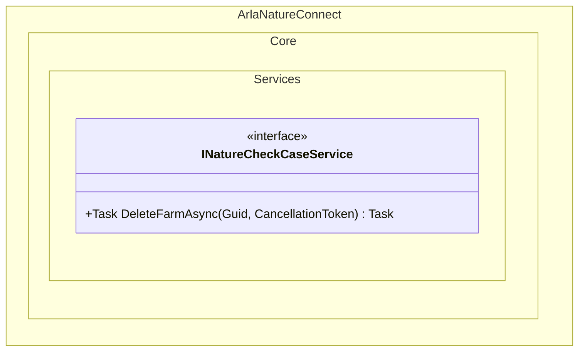

## UC002B.5 – Design Class Diagram

This diagram builds upon UC002B.4 and adds deletion classes.

```mermaid
classDiagram
    direction TB
    %% === DCD – UC002B.5: Delete Farm (Builds on UC002B.4) ===

    namespace ArlaNatureConnect.Core.Services {
        class INatureCheckCaseService {
            <<interface>>
            +Task DeleteFarmAsync(Guid, CancellationToken) Task
        }
    }
```

