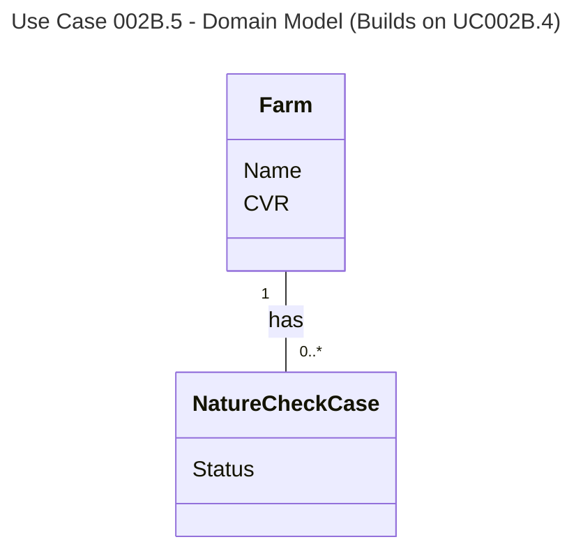

# UC002B.5 Domain Model

Domain Model for Delete Farm use case. This builds upon UC002B.4.

**New Domain Concepts (UC002B.5):**
- **Farm Deletion** - The process of removing a farm from the system
- **Deletion Constraint** - Farms with active cases cannot be deleted

**Business Rules:**
- Farms with active Nature Check Cases (status "Assigned" or "InProgress") cannot be deleted
- Deletion is permanent and cascades to related data

