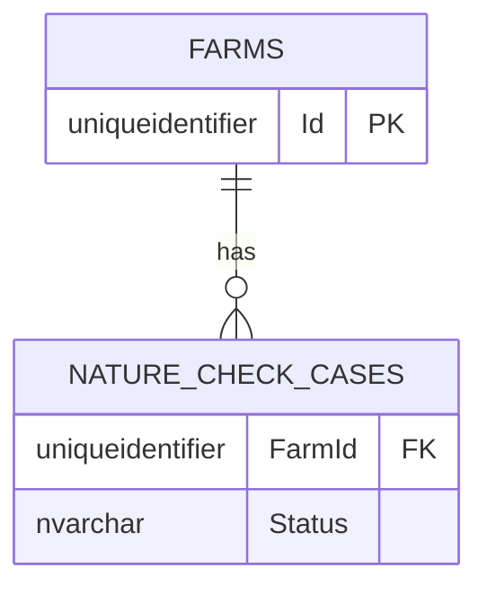

# UC002B.5 – Entity Relationship Diagram

ER Diagram for Delete Farm. This builds upon UC002B.4.

**Note:** This diagram shows tables relevant to UC002B.5. Tables from UC001/UC002 (FARMS, PERSONS) are assumed to already exist.



## Table Origins

| Table | Origin | Description |
|-------|--------|-------------|
| **FARMS** | UC002 | Farm information (assumed to exist from UC002) |
| **NATURE_CHECK_CASES** | UC002B | Nature Check Case assignments (from UC002B.1/UC002B.2) |

**Note:** UC002B.5 assumes that all tables from UC001, UC002, and previous UC002B user stories already exist.

## Deletion Constraints

- Farms with active cases (Status IN ('Assigned', 'InProgress')) cannot be deleted
- Foreign key constraints enforce referential integrity

## Entity Framework Deletion Flow

### Service Layer Validation

1. **Check Farm Exists:** `IFarmRepository.GetByIdAsync(farmId)`
2. **Check Active Cases:** `INatureCheckCaseRepository.FarmHasActiveCaseAsync(farmId)`
3. **Delete Farm:** `IFarmRepository.DeleteAsync(farmId)`

### Repository Layer

```csharp
// From Repository.cs
await using AppDbContext ctx = _factory.CreateDbContext();
Farm? entity = await ctx.Set<Farm>()
    .FirstOrDefaultAsync(f => f.Id == farmId, cancellationToken);

if (entity != null)
{
    ctx.Set<Farm>().Remove(entity);
    await ctx.SaveChangesAsync(cancellationToken);  // Generates DELETE SQL
}
```

### Business Rules

- Validation happens in service layer before deletion
- No stored procedures or triggers needed
- EF Core generates DELETE SQL automatically