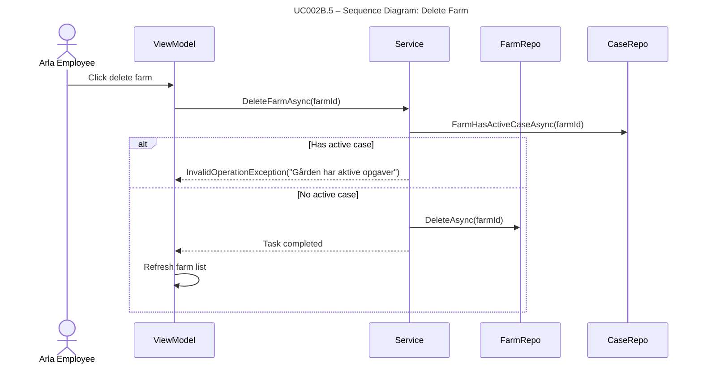

## UC002B.5 – Sequence Diagram: Delete Farm

```mermaid
sequenceDiagram
    title UC002B.5 – Sequence Diagram: Delete Farm

    actor ArlaEmployee as Arla Employee
    participant ViewModel
    participant Service
    participant FarmRepo
    participant CaseRepo

    ArlaEmployee ->> ViewModel: Click delete farm
    ViewModel ->> Service: DeleteFarmAsync(farmId)
    
    Service ->> CaseRepo: FarmHasActiveCaseAsync(farmId)
    alt Has active case
        Service -->> ViewModel: InvalidOperationException("Gården har aktive opgaver")
    else No active case
        Service ->> FarmRepo: DeleteAsync(farmId)
        Service -->> ViewModel: Task completed
        ViewModel ->> ViewModel: Refresh farm list
    end
```

