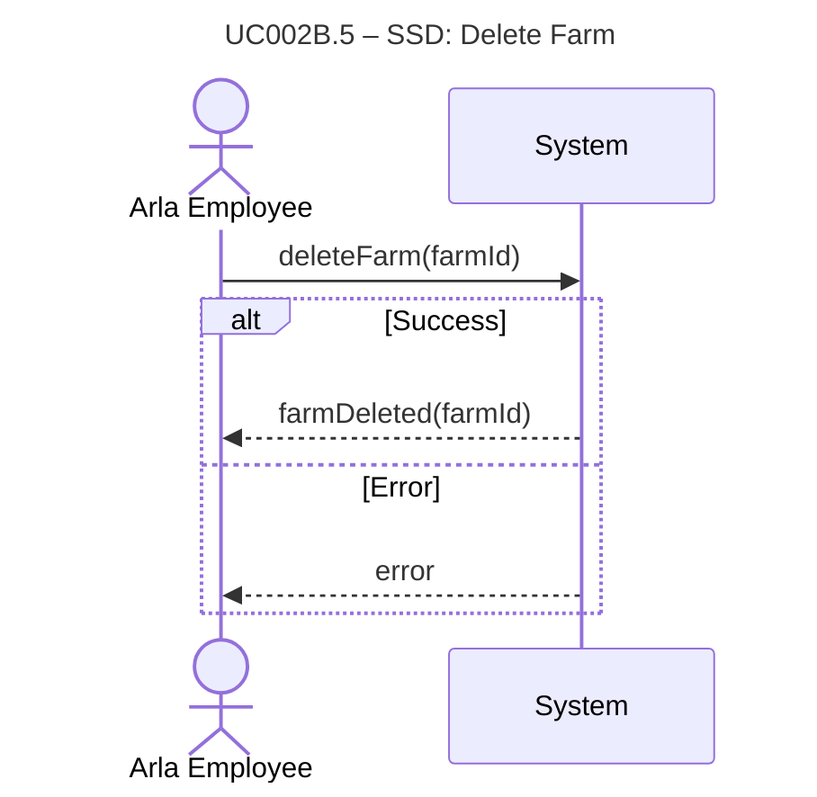

# UC002B.5-SSD – Delete Farm

System Sequence Diagram showing the interaction between the Arla Employee actor and the System, following Larmann's UML conventions.

**Notes:**
- This SSD shows the high-level interaction for deleting a farm.
- All internal operations (active case checks, cascade deletion, etc.) are hidden within the system boundary.

