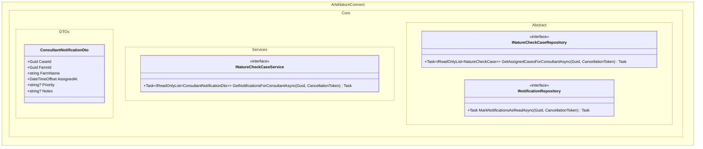

## UC002B.6 – Design Class Diagram

This diagram builds upon UC002B.5 and adds notification viewing classes.

```mermaid
classDiagram
    direction TB
    %% === DCD – UC002B.6: View Consultant Notifications (Builds on UC002B.5) ===

    namespace ArlaNatureConnect.Core.DTOs {
        class ConsultantNotificationDto {
            +Guid CaseId
            +Guid FarmId
            +string FarmName
            +DateTimeOffset AssignedAt
            +string? Priority
            +string? Notes
        }
    }

    namespace ArlaNatureConnect.Core.Services {
        class INatureCheckCaseService {
            <<interface>>
            +Task~IReadOnlyList~ConsultantNotificationDto~~ GetNotificationsForConsultantAsync(Guid, CancellationToken) Task
        }
    }

    namespace ArlaNatureConnect.Core.Abstract {
        class INatureCheckCaseRepository {
            <<interface>>
            +Task~IReadOnlyList~NatureCheckCase~~ GetAssignedCasesForConsultantAsync(Guid, CancellationToken) Task
        }

        class INotificationRepository {
            <<interface>>
            +Task MarkNotificationsAsReadAsync(Guid, CancellationToken) Task
        }
    }
```

