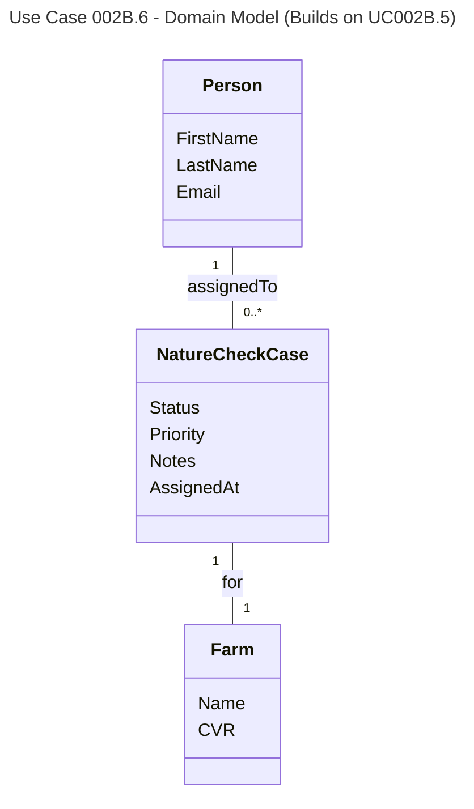

# UC002B.6 Domain Model

Domain Model for View Consultant Notifications use case. This builds upon UC002B.5.

**New Domain Concepts (UC002B.6):**
- **Notification View** - The view of assigned cases for a consultant
- **ConsultantNotificationDto** - A data transfer object representing a notification (generated from NatureCheckCase data, not stored as separate entity)

**Business Rules:**
- Cases are sorted by AssignedAt date (newest first)
- Notifications are generated from NatureCheckCase data when consultant views them (not stored in database)
- No "mark as read" functionality - notifications are always current based on case data
- All operations use Entity Framework Core repositories with LINQ queries

