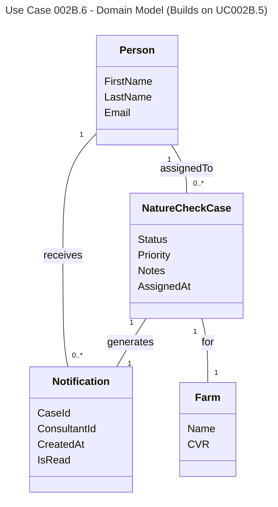

# UC002B.6 Domain Model

Domain Model for View Consultant Notifications use case. This builds upon UC002B.5.

**New Domain Concepts (UC002B.6):**
- **Notification View** - The view of assigned cases for a consultant
- **Read Status** - Whether a notification has been viewed

**Business Rules:**
- Cases are sorted by AssignedAt date (newest first)
- Notifications are marked as read when viewed

