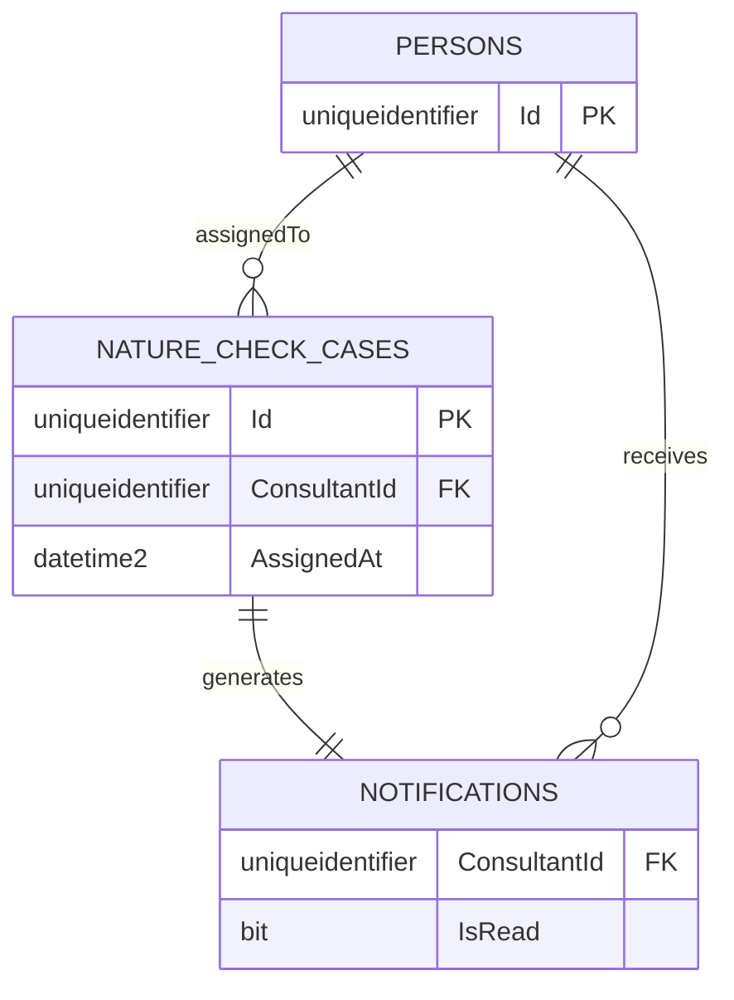

# UC002B.6 – Entity Relationship Diagram

ER Diagram for View Consultant Notifications. This builds upon UC002B.5.

**Note:** This diagram shows tables relevant to UC002B.6. Tables from UC001/UC002 (PERSONS, FARMS) are assumed to already exist.

## Table Origins

| Table | Origin | Description |
|-------|--------|-------------|
| **PERSONS** | UC002 | Person information (assumed to exist from UC002) |
| **NATURE_CHECK_CASES** | UC002B | Nature Check Case assignments (from UC002B.1/UC002B.2) |
| **NOTIFICATIONS** | UC002B.2 | Database notifications for consultants (from UC002B.2) |
| **FARMS** | UC002 | Farm information (assumed to exist from UC002, referenced via NATURE_CHECK_CASES) |

**Note:** UC002B.6 assumes that all tables from UC001, UC002, and previous UC002B user stories already exist.

## View-Specific Details

- Cases are sorted by AssignedAt (newest first)
- Notifications are marked as read when viewed

