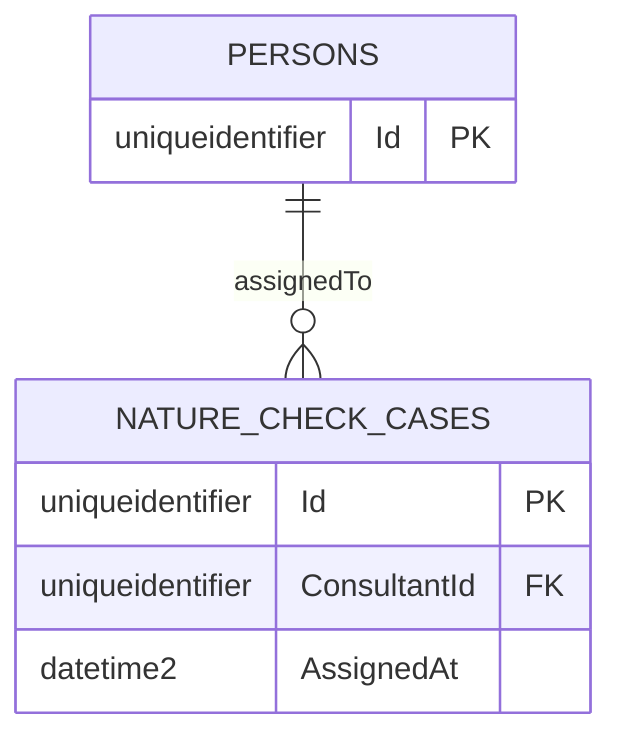

# UC002B.6 – Entity Relationship Diagram

ER Diagram for View Consultant Notifications. This builds upon UC002B.5.

**Note:** This diagram shows tables relevant to UC002B.6. Tables from UC001/UC002 (PERSONS, FARMS) are assumed to already exist.



## Table Origins

| Table | Origin | Description |
|-------|--------|-------------|
| **PERSONS** | UC002 | Person information (assumed to exist from UC002) |
| **NATURE_CHECK_CASES** | UC002B | Nature Check Case assignments (from UC002B.1/UC002B.2) |
| **FARMS** | UC002 | Farm information (assumed to exist from UC002, referenced via NATURE_CHECK_CASES) |

**Note:** UC002B.6 assumes that all tables from UC001, UC002, and previous UC002B user stories already exist.

**Important:** In Entity Framework Core implementation, there is **NO separate NOTIFICATIONS table**. Notifications are generated from `NatureCheckCase` entities in the service layer and returned as `ConsultantNotificationDto` objects.

## View-Specific Details

- Cases are sorted by AssignedAt (newest first)
- Notifications are generated from NatureCheckCase data when consultant views them
- No "IsRead" flag - notifications are regenerated each time (current implementation)

## Entity Framework Notification Query Flow

### Service Layer: GetNotificationsForConsultantAsync()

1. **Query Assigned Cases:**
   ```csharp
   IReadOnlyList<NatureCheckCase> assignedCases = await _natureCheckCaseRepository
       .GetAssignedCasesForConsultantAsync(consultantId, cancellationToken);
   ```
   - Queries NatureCheckCases where ConsultantId matches and Status = Assigned
   - Sorted by AssignedAt (newest first)

2. **Load Related Farms:**
   ```csharp
   List<Farm> farms = (await _farmRepository.GetAllAsync(cancellationToken))
       .Where(f => farmIds.Contains(f.Id))
       .ToList();
   ```

3. **Convert to DTOs:**
   ```csharp
   notifications.Add(new ConsultantNotificationDto
   {
       CaseId = caseEntity.Id,
       FarmId = caseEntity.FarmId,
       FarmName = farm.Name,
       AssignedAt = caseEntity.AssignedAt ?? caseEntity.CreatedAt,
       Priority = caseEntity.Priority,
       Notes = caseEntity.Notes
   });
   ```

4. **Return Sorted DTOs:**
   - Returned as in-memory DTOs, not database entities
   - No database table for notifications

