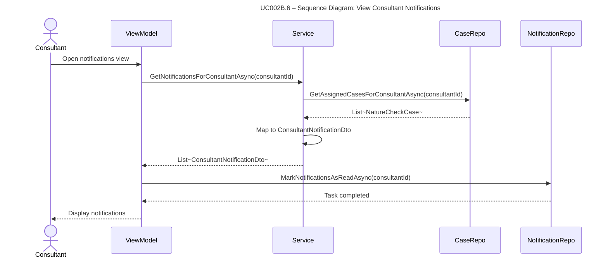

## UC002B.6 – Sequence Diagram: View Consultant Notifications

```mermaid
sequenceDiagram
    title UC002B.6 – Sequence Diagram: View Consultant Notifications

    actor Consultant as Consultant
    participant ViewModel
    participant Service
    participant CaseRepo
    participant NotificationRepo

    Consultant ->> ViewModel: Open notifications view
    ViewModel ->> Service: GetNotificationsForConsultantAsync(consultantId)
    
    Service ->> CaseRepo: GetAssignedCasesForConsultantAsync(consultantId)
    CaseRepo -->> Service: List~NatureCheckCase~
    
    Service ->> Service: Map to ConsultantNotificationDto
    Service -->> ViewModel: List~ConsultantNotificationDto~
    
    ViewModel ->> NotificationRepo: MarkNotificationsAsReadAsync(consultantId)
    NotificationRepo -->> ViewModel: Task completed
    
    ViewModel -->> Consultant: Display notifications
```

