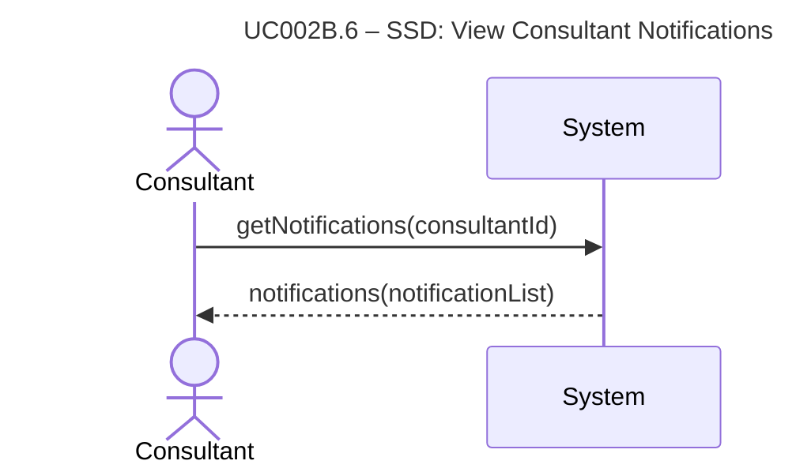

# UC002B.6-SSD – View Consultant Notifications

System Sequence Diagram showing the interaction between the Consultant actor and the System, following Larmann's UML conventions.

**Notes:**
- This SSD shows the high-level interaction for viewing consultant notifications.
- All internal operations (case loading, DTO generation, sorting, etc.) are hidden within the system boundary.

