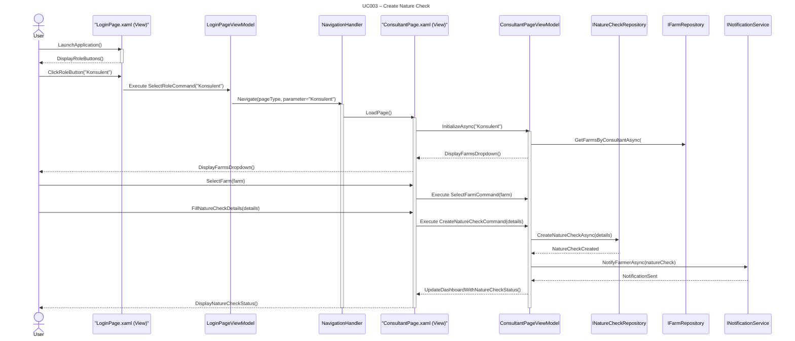

```mermaid
sequenceDiagram
    title UC003 – Create Nature Check

    actor User
    participant LoginPage as "LoginPage.xaml (View)"
    participant LoginPageViewModel
    participant NavigationHandler
    participant ConsultantPage as "ConsultantPage.xaml (View)"
    participant ConsultantPageViewModel
    participant INatureCheckRepository
    participant IFarmRepository
    participant INotificationService
    
    %% Step 1: Launch
    User ->> LoginPage: LaunchApplication()
    activate LoginPage
    LoginPage -->> User: DisplayRoleButtons()
    deactivate LoginPage
    
    %% Step 2: Role selection
    User ->> LoginPage: ClickRoleButton("Konsulent")
    activate LoginPage
    LoginPage ->> LoginPageViewModel: Execute SelectRoleCommand("Konsulent")
    activate LoginPageViewModel
    LoginPageViewModel ->> NavigationHandler: Navigate(pageType, parameter="Konsulent")
    activate NavigationHandler
    
    %% Step 3: Navigation to Consultant Page
    NavigationHandler ->> ConsultantPage: LoadPage()
    activate ConsultantPage
    ConsultantPage ->> ConsultantPageViewModel: InitializeAsync("Konsulent")
    activate ConsultantPageViewModel
    ConsultantPageViewModel ->> IFarmRepository: GetFarmsByConsultantAsync(
    ConsultantPageViewModel -->> ConsultantPage: DisplayFarmsDropdown()
    ConsultantPage -->> User: DisplayFarmsDropdown()
    User ->> ConsultantPage: SelectFarm(farm)
    ConsultantPage ->> ConsultantPageViewModel: Execute SelectFarmCommand(farm)
        
    %% Step 4: Create Nature Check
    User ->> ConsultantPage: FillNatureCheckDetails(details)
    ConsultantPage ->> ConsultantPageViewModel: Execute CreateNatureCheckCommand(details)
    ConsultantPageViewModel ->> INatureCheckRepository: CreateNatureCheckAsync(details)
    INatureCheckRepository -->> ConsultantPageViewModel: NatureCheckCreated
    ConsultantPageViewModel ->> INotificationService: NotifyFarmerAsync(natureCheck)
    INotificationService -->> ConsultantPageViewModel: NotificationSent
    ConsultantPageViewModel -->> ConsultantPage: UpdateDashboardWithNatureCheckStatus()
    ConsultantPage -->> User: DisplayNatureCheckStatus()
        
    deactivate ConsultantPageViewModel
    deactivate ConsultantPage
    deactivate NavigationHandler 
```
