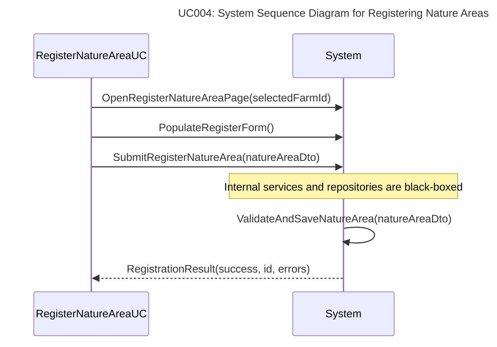
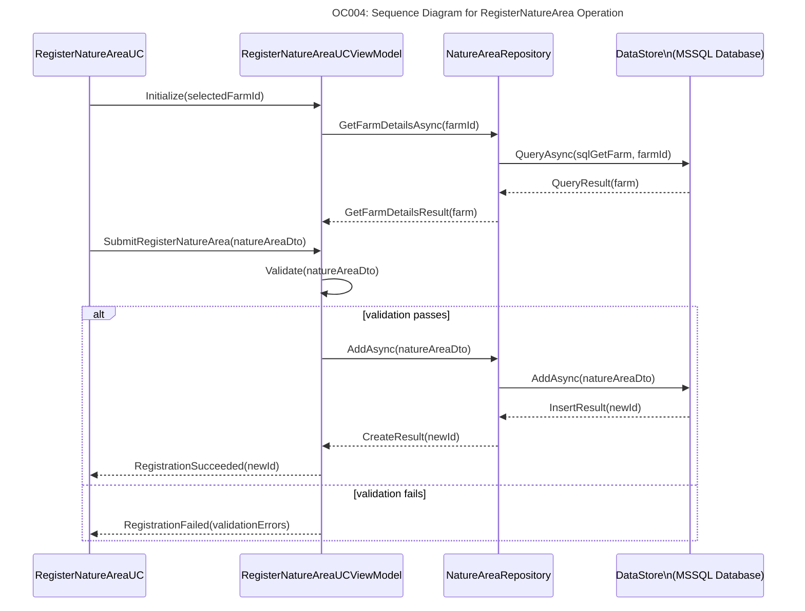
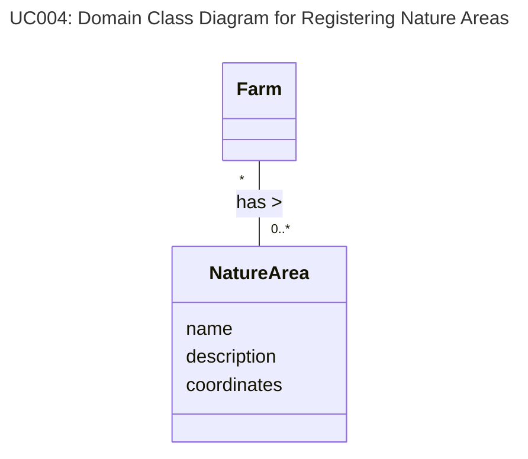

# Use Case 004 - Register Nature Areas
This document outlines the artifacts associated with Use Case 004 - Register Nature Areas. The purpose of this use case is to facilitate the registration and management of nature areas within the system.

## User Story
As an Employee,
I want to register new nature areas
so that they can be managed and preserved effectively.

## User Case Brief
Employees can register new nature areas by providing necessary details such as area name, coordinates, size, and type of the area.
The system will store this information and allow for future management and updates.

-ID: UC-004-B
-Primary Actor: Employee
-Stakeholders:
	- Employee: Wants to register and manage nature areas.
	- Farmer: Interested in the preservation of nature areas.
	- Consultant: Provides expertise on nature area management.
	- System Administrator: Ensures the system functions correctly.
- Scope: WinUI application
- Level: User goal
- Cross references:
	- See the User Story above: [User Story](#user-story)
  - See the Domain Model below: [UC-004-DM](#domain-model)
 
### Preconditions
- The employee is logged into the system.
- Is on the "Register Nature Area" page.

### Postconditions
- A new nature area is registered in the system with the provided details.
- The nature area can be viewed and managed by authorized users.

### Primary success scenario (happy path)
1. Employee navigates chooses a farm to register a nature area for.
1. Employee selects the option to register a new nature area.
1. Employee fills in the required details (name, coordinates, size, type).
1. Employee submits the registration form.
1. System validates the input and saves the new nature area.
1. System confirms the successful registration of the nature area.
1. Employee receives confirmation and can view the registered nature area.

## System Sequence Diagram
- ID: UC-004-SSD
- Cross references:
  - See the Use Case Brief above: [UC-004-BC](#user-case-brief)


## OC - Operations Contracts
- ID: UC-004-OC
- Cross references:
  - See the Use Case Brief above: [UC-004-BC](#user-case-brief)

### Operation Contract: RegisterNatureArea

**Operation**: RegisterNatureArea
- **Description**: Registers a new nature area in the system with the provided details.
- **Preconditions**:
   - Employee is logged in.
   - Employee is on the "Register Nature Area" page.

**Postconditions**:
   - A new nature area is created and stored in the system.
   - The nature area is associated with the selected farm.

## Sequence Diagram



## Domain Model

- ID: UC-004-DM
- Cross references:
	- See the User Story above: [User Story](#user-story)
	- See the Use Case Brief above: [UC-004-BC](#user-case-brief)

### Domain Model Diagram


### Domain Model Description
- **NatureArea**: Represents a nature area with attributes such as name, coordinates, size
- , and type. It includes methods to register and update details of the nature area.
- **Employee**: The primary actor who registers nature areas. See UC-002-DM
- **Farm**: Represents a farm that can contain multiple nature areas. See UC-002-DM

### DCD Diagram
```mermaid
---
  title: "UC004: Domain Class Diagram for Registering Nature Areas (DCD)"
---
classDiagram
  direction TB

  namespace ArlaNatureConnect.Domain.Entities {
    class NatureArea {
      +Guid Id
      +Guid FarmId
      +string Name
      +string? Description
      +string Coordinates
      +string Type
      +virtual Farm Farm
    }

    class Farm {
    }
  }

  namespace ArlaNatureConnect.Core.Abstract {
    class IRepository~TEntity~ {
      <<interface>>
    }

    class INatureAreaRepository {
      <<interface>>
    }
  }

  namespace ArlaNatureConnect.Infrastructure.Repositories {
    class Repository~TEntity~ {
    }

    class NatureAreaRepository {
    }
  }

  %% Associations
  Farm "*" -- "0..*" NatureArea : has >

  %% Interface implementations
  INatureAreaRepository --> NatureArea : manages

  %% Inheritances and implementations
  NatureAreaRepository --|> INatureAreaRepository : implements
  Repository ..|> IRepository~TEntity~ : implements

  %% Generic Repository inheritance
  NatureAreaRepository ..|> Repository~TEntity~ : inheritance
  ```

  ### DCD Description
  See [DCD] for detailed descriptions of the entities, repositories, and their relationships involved in registering nature areas.

  <!-- Links to relevant code artifacts -->
  [DCD]: ../DCD.md
