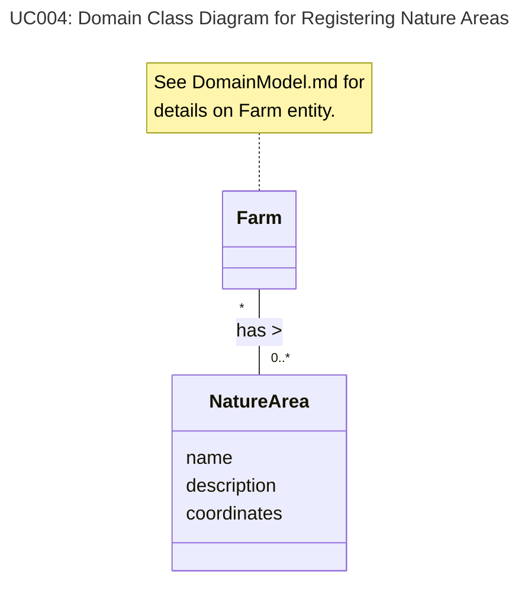

```mermaid
---
  title: "UC004: Domain Class Diagram for Registering Nature Areas"
---
classDiagram
  direction TB
  class NatureArea {
    name
    description
    coordinates
  }

  class Farm {
  }

  note for Farm "See DomainModel.md for 
  details on Farm entity."

  Farm "*" -- "0..*" NatureArea : has >

```