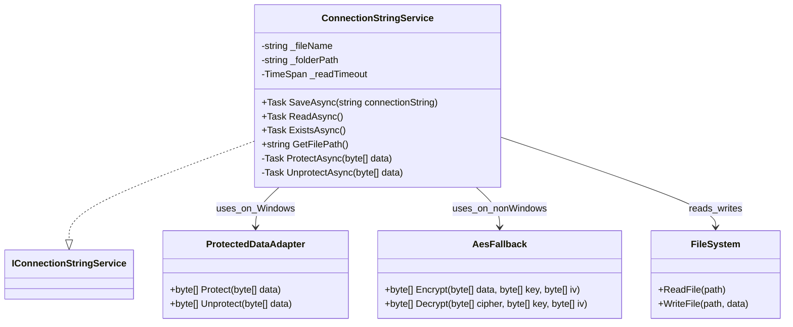

# ConnectionStringService

## Table of contents

- [Short summary](#short-summary)
- [Source](#source)
- [API surface](#api-surface)
- [Why use it](#why-use-it)
- [Registration](#registration)
- [Quick usage patterns](#quick-usage-patterns)
  - [1) Save a connection string](#1-save-a-connection-string)
  - [2) Read a connection string](#2-read-a-connection-string)
  - [3) Check existence](#3-check-existence)
- [Behavior notes](#behavior-notes)
- [Encryption details](#encryption-details)
- [Tests](#tests)
- [Class diagram](#class-diagram)

## Short summary

`ConnectionStringService` persists an application database connection string to the current user's application-data folder and encrypts it on disk.
It exposes async methods to save, read and verify existence of the connection file.
The class tries to be safe against concurrent file access and supports Windows DPAPI and a cross-platform AES fallback.

## Source

- Implementation: [ConnectionStringService.cs](../../../src/ArlaNatureConnect.Core/Services/ConnectionStringService.cs)
- Interface: [IConnectionStringService.cs](../../../src/ArlaNatureConnect.Core/Services/IConnectionStringService.cs)

## API surface

- `Task SaveAsync(string connectionString)` — encrypt and write the connection string to disk
- `Task<string?> ReadAsync()` — read and decrypt the connection string; returns `null` if file is missing or cannot be decrypted
- `Task<bool> ExistsAsync()` — returns whether the connection file exists

## Why use it

Use this service to securely store the database connection string per user. The service encapsulates encryption, file-location, safe reading with a short unlock timeout and a cross-platform fallback for encryption when DPAPI is not available.

## Registration

Register in your DI container if you want to resolve it via constructor injection:

```csharp
// Startup / App.xaml.cs
services.AddSingleton<IConnectionStringService, ConnectionStringService>();
```

Note: the infrastructure DI setup in this repo reads the connection string during host build (see `Infrastructure.DependencyInjection`) and expects the connection to already be present; adjust registration/initialization ordering accordingly.

## Quick usage patterns

### 1) Save a connection string

```csharp
await connectionStringService.SaveAsync("Server=...;Database=...;User Id=...;Password=...");
```

- The string is encrypted and written to `%AppData%/ArlaNatureConnect/conn.dat` (on Windows) or the equivalent user app-data folder on other platforms.

### 2) Read a connection string

```csharp
string? cs = await connectionStringService.ReadAsync();
if (string.IsNullOrWhiteSpace(cs))
{
    // no connection configured
}
else
{
    // use cs
}
```

- `ReadAsync()` waits briefly (up to 3s) for the file to be unlocked before attempting to read.
- If the file exists but cannot be decrypted the method returns `null`.

### 3) Check existence

```csharp
bool exists = await connectionStringService.ExistsAsync();
```

## Behavior notes

- File location: the service creates and uses a directory under the user's application-data folder named `ArlaNatureConnect` and a filename `conn.dat` by default.
- Read timeout: when reading, the service polls for the file to be unlocked but fails with an `IOException` if the timeout is reached.
- Concurrency: `ReadAsync` opens the file with `FileShare.ReadWrite` to avoid hangs if another process temporarily holds the file.
- Errors: `ReadAsync` throws an `InvalidOperationException` when read/decrypt fails in the normal Windows code path; on non-Windows decrypt attempts return `null` on failure.

## Encryption details

- On Windows the class uses DPAPI (`ProtectedData.Protect` / `Unprotect`) scoped to the current user.
- On non-Windows platforms it falls back to AES-CBC with a 256-bit key derived from a deterministic value built from `Environment.UserName`, `Environment.MachineName` and the application base path. The IV is prepended to the ciphertext.

Security notes: the AES fallback derives a key tied to the user/machine/app path. This is suitable for basic protection of the connection string but is not as robust as platform-backed key stores. Consider using platform-specific secure storage (Keychain, Keyring) for stronger protection if required.

## Tests

Unit tests for `ConnectionStringService` are under `tests/ArlaNatureConnect/TestCore/Services/ConnectionStringServiceTests.cs`. They cover:

- Save/read round-trips (Windows DPAPI path)
- Reflection-access tests for the private encryption helpers
- AES fallback round-trip tests
- Behavior when decryption fails

## Class diagram

