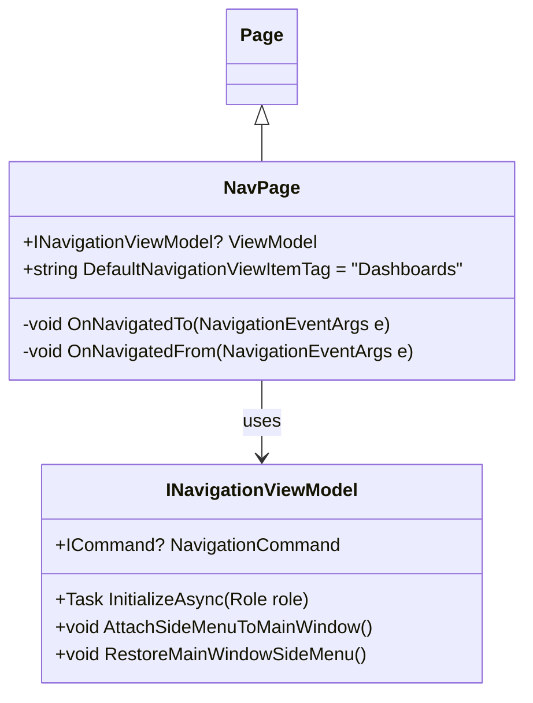

# NavPage

## Table of contents

- [Short summary](#short-summary)
- [Source](#source)
- [API surface](#api-surface)
- [Why use it](#why-use-it)
- [Quick examples](#quick-examples)
  - [1) Derive a page and set the ViewModel](#1-derive-a-page-and-set-the-viewmodel)
  - [2) Navigate to a `NavPage` and pass a `Role`](#2-navigate-to-a-navpage-and-pass-a-role)
- [Related types](#related-types)
- [Notes and best practices](#notes-and-best-practices)
- [Class diagram](#class-diagram)


## Short summary

`NavPage` is an abstract WinUI `Page` base class used by pages that host a role-aware view-model and a navigation/side-menu experience. It centralizes the common navigation initialization flow (role-based initialization, default selected view, and side-menu attachment/restoration) so derived pages remain small and consistent.


## Source

- Implementation: `src/ArlaNatureConnect.WinUI/ArlaNatureConnect.WinUI/Views/Controls/Abstracts/NavPage.cs`


## API surface

- `public FarmerPageViewModel? ViewModel` — the view-model the page hosts. Must be set before navigation.
- `public string DefaultNavigationViewItemTag` — default tag executed on navigation (default: `"Dashboards"`).
- `protected override async void OnNavigatedTo(NavigationEventArgs e)` — lifecycle hook that:
  - validates `ViewModel` is not null (throws `InvalidOperationException` if it is);
  - if `e.Parameter` is a `Role`, calls `await ViewModel.InitializeAsync(role)`;
  - executes `ViewModel.NavigationCommand` with `DefaultNavigationViewItemTag` to set the default view;
  - calls `ViewModel.AttachSideMenuToMainWindow()` to attach the page's side menu to the main window.
- `protected override void OnNavigatedFrom(NavigationEventArgs e)` — lifecycle hook that calls `ViewModel.RestoreMainWindowSideMenu()` to restore previous side-menu children.


## Why use it

- Encapsulates common role-based initialization and navigation behavior used by pages that present role-specific dashboards or side-menu driven content.
- Enforces a consistent lifecycle: initialize view-model with the current `Role`, set the default navigation item, and attach/restore the application's side menu.
- Reduces duplicate code across pages (Farmer/Administrator/Consultant pages) that follow the same pattern.
- Provides a single place to update side-menu attachment/restore logic or default navigation behavior.


## Quick examples

### 1) Derive a page and set the ViewModel

Derived page code-behind (minimal):

```csharp
public sealed partial class FarmerPage : NavPage
{
    public FarmerPage()
    {
        InitializeComponent();

        // Ensure ViewModel is set before the page is navigated to.
        // Prefer constructor injection / DI in real apps.
        this.ViewModel = new FarmerPageViewModel(/* dependencies */);
    }
}
```

Notes:
- `NavPage.OnNavigatedTo` expects `ViewModel` to be non-null and will throw if it is not set. Set the view-model in the constructor or before navigation.
- If the page requires a different default view, override `DefaultNavigationViewItemTag` in the constructor: `DefaultNavigationViewItemTag = "Reports";`.


### 2) Navigate to a `NavPage` and pass a `Role`

When navigating use the role as the navigation parameter so `NavPage` will call `InitializeAsync` on the view-model:

```csharp
// Example: navigate from a Frame or NavigationService
frame.Navigate(typeof(FarmerPage), Role.Farmer);
```

`NavPage` will then:
- call `await ViewModel.InitializeAsync(Role.Farmer)` (if `e.Parameter` is a `Role`);
- execute `ViewModel.NavigationCommand` with the default tag (e.g. `"Dashboards"`);
- attach the page's side menu to the main window via `AttachSideMenuToMainWindow()`.


## Related types

- `FarmerPageViewModel` — the concrete view-model type used by many `NavPage` derivatives.
- `NavigationCommand` / navigation helpers on the view-model — used to switch the visible content.
- `Role` — parameter type passed during navigation to instruct role-specific initialization.


## Notes and best practices

- Always set `ViewModel` before navigation. Prefer DI or a view-model locator to construct/provide the view-model.
- Keep UI-specific logic inside views. `NavPage` centralizes only navigation and side-menu wiring — avoid adding control-specific UI manipulation in view-models.
- If overriding `OnNavigatedTo` or `OnNavigatedFrom` in a derived page, call `base.OnNavigatedTo(e)` / `base.OnNavigatedFrom(e)` to preserve initialization and side-menu behavior.
- Use `DefaultNavigationViewItemTag` to customize the initial section shown when the page loads.
- `NavPage` assumes the view-model implements `InitializeAsync(Role)` and exposes `NavigationCommand`, `AttachSideMenuToMainWindow()` and `RestoreMainWindowSideMenu()`; derived view-models should implement these members.


## Class diagram

